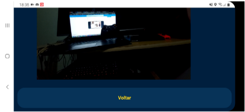
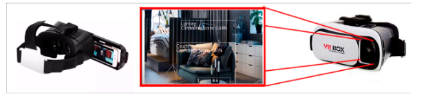

# Projeto Vision

Website com o propósito de ser acessado via aparelho celular com a finalidade de ser uma ferramenta mais acessível para auxíliar deficientes visuais a ter um melhor reconhecimento do ambiente ao seu redor, através da 
narração por voz dos objetos detectados pela API de reconhecimento de objetos do Google Cloud Vision na foto tirada periodicamente pela câmera frontal do celular.

Vídeo de testes realizados por deficientes visuais
https://youtu.be/kjeXs4eA6LU

## Tecnologias implementadas

- Javascript
- Integração com a API Google Cloud Vision
- Integração com a API do Google Cloud Translation para tradução da resposta da API Cloud Vision

## Sugestão de utilização para melhor experiência

- Suporte de realidade aumentada para que o celular fique fixo no rosto e facilite a utilização em movimento

